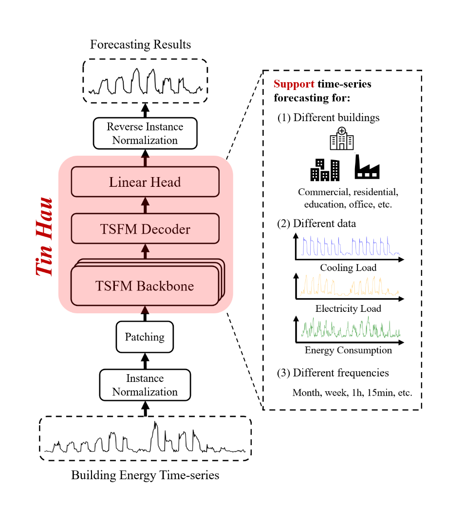
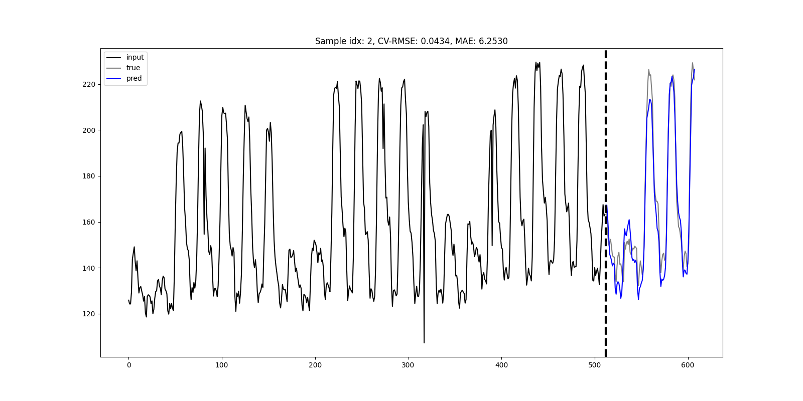

<h1 align="center">
    Tin Hau v0.8<br>A Building Time-series Foundation Model
</h1>

## Introduction

Tin Hau is a time-series foundation model for building load/energy forecasting which embeds the knowledge of thousands of 
buildings and adopts an advanced training strategy.
Thus, for different buildings with different contexts (e.g., dining areas, sports areas, etc), Tin Hau v0.8 can perform accurate 
forecasting with limited (i.e., few-shot forecasting) or even no knowledge (i.e., zero-shot forecasting) about the target building.
_**News: The latest version Tin Hau v0.81 which supports multi-resolution (i.e., 1 h, 15 mins) is ready-to-use. Apply for the project
of Tin Hau v0.81 at [`Application Form for Tin Hau v0.81`](https://forms.gle/2BCMR76fZAdb3rAx5)**_

[//]: # (Developed based on Tiny Time Mixer from IBM, Tin Hau is a compact and lightweight model with only 1M parameters such that)
[//]: # (it can be run even on **CPU-only machines**.)



## Specification

|                                   Model name                                    |                Tin Hau v0.8                 |
|:-------------------------------------------------------------------------------:|:-------------------------------------------:|
|                        Model size (number of parameters)                        |                     1M                      |
|                               Model Architecture                                |                TSMixer-based                |
|                    Context length (number of input samples)                     |                     512                     |
|                  Horizon length (number of forecasted samples)                  | 96 (can be adapted to any positive integer) |
|                         Uni-/Multi-variate forecasting                          |           Uni-variate forecasting           |
|                         Point/Probabilistic forecasting                         |              Point forecasting              |
|                            Single-/Multi-resolution                             |           Single-resolution (1 h)           |
| Inference cost (average seconds needed on a building with one year hourly data) |           5.64 (GPU: RTX 4070 Ti)           |

## Initial Setup
Clone the repository using the following command.
```bash
git clone https://github.com/Dylan0211/TinHau-forecasting.git
```
The supported python version is 3.8. Use the following command to install required packages.
```bash
pip install -r requirements.txt
```

## Tutorial: How to do model inference on your own building data

### Step 1: prepare raw data file
- The target building energy data should be stored in a `{target_building}.csv` file with two columns:
    - **timestamp_column** is the column that contains the timestamp of the time-series (e.g., "time").
    - **target_columns** are the columns to be forecasted (e.g., "power").
    
- The `{target_building}.csv` file should be put under `dataset/{dataset_name}/`.
    - An example is the `Fox_office_Joy.csv` file under `dataset/Genome/`.

        |  | time | power |
        | :-----: | :----: | :----: |
        | 1 | 2016-12-29 12:00:00 | 205.47 |
        | 2 | 2016-12-29 13:00:00 | 206.74 |
        | 3 | 2016-12-29 14:00:00 | 206.77 |
        | 4 | 2016-12-29 15:00:00 | 205.77 |
        | 5 | 2016-12-29 16:00:00 | 201.93 |


### Step 2: config data loader
- The config of the target building should be specified for the data loader. Specifically, a config dict for the target 
building should be added to the `get_data()` function under `tsfm_public/models/tinytimemixer/utils/ttm_utils.py`. 
An example is shown as follows. Here, **"Genome"** is the name of the config dict (the same as the `{dataset_name}`) 
which contains variables to be specified:
    - **"timestamp_column"** is the name of the column that contains the timestamp of the time-series.
    - **"target_columns"** are the names of the columns that contains the variable to be forecasted.
    - **"split_config"** specifies the proportion of data used for training and testing. Here we set training ratio as 
  0.1 such that only 10% data will be used for few-shot forecasting.

  ```python
  # ttm_utils.py
  def get_data(
    dataset_name: str,
    file_name: str,
    data_root_path: str,
    context_length=512,
    forecast_length=96,
    fewshot_fraction=1.0,
  ):
    print(context_length, forecast_length)

    config_map = {
        "Genome": {  # for evaluating Genome
            "dataset_path": file_name,
            "timestamp_column": "time",
            "target_columns": ["power"],
            "split_config": {
                "train": 0.1,
                "test": 0.9,
            },
        },
    }
  ```

### Step 3: evaluate the model on the target building
- Evaluation can be conducted by running the `eval.py`. There are some parameters to be adjusted.
    - **dataset_name** is the name of your dataset, i.e.,`{dataset_name}`.
    - **file_name** is the name of the target building, i.e.,`{target_building}`.
    - **evaluation_mode** is the way for evaluation. This can be either 'zeroshot' or 'fewshot'.
    - **horizon_length** is the forecasting length. This value can be **any positive integer**.
  
  ```python
  # eval.py
  if __name__ == '__main__':
    # note: parameters that need to be adjusted
    dataset_name = "Genome"
    file_name = 'Fox_office_Joy'
    horizon_length = 96  # forecasting length (can be any positive integer)
    evaluation_mode = 'zeroshot'  # zeroshot, fewshot
  ```
- An example of evaluation output is shown as follows. Here the black line is the input time-series data, the black line
and the grey line are the forecasted result and the ground truth, respectively.
There are two metrics supported, i.e., mean absolute error 
(MAE) and coefficient variation of the root mean squared error (CV-RMSE).


## Latest version: Tin Hau v0.81
We present Tin Hau v0.81 which supports multi-resolution forecasting (at 1 hour, 15 mins, etc) and outperforms Tin Hau v0.8 by **_5.6%_**
in terms of CV-RMSE.
The specification of Tin Hau v0.81 is shown below.
**_Apply for the project of Tin Hau v0.81 by filling out this [`Application Form for Tin Hau v0.81`](https://forms.gle/2BCMR76fZAdb3rAx5) and we will send 
the download link to your email._**

|                                   Model name                                    |                Tin Hau v0.81                |
|:-------------------------------------------------------------------------------:|:-------------------------------------------:|
|                        Model size (number of parameters)                        |                     1M                      |
|                               Model Architecture                                |                TSMixer-based                |
|                    Context length (number of input samples)                     |                     512                     |
|                  Horizon length (number of forecasted samples)                  | 96 (can be adapted to any positive integer) |
|                         Uni-/Multi-variate forecasting                          |           Uni-variate forecasting           |
|                         Point/Probabilistic forecasting                         |              Point forecasting              |
|                            Single-/Multi-resolution                             |    Multi-resolution (1 h, 15 mins, etc)     |
| Inference cost (average seconds needed on a building with one year hourly data) |           5.71 (GPU: RTX 4070 Ti)           |

## Feedback
Note that this is an early version of Tin Hau so we admit that there may be some building contexts where our
model perform poorly on.
In order to continuously improve Tin Hau, we are willing to hear your feedbacks or questions.
Therefore, if you encounter any problem when trying to run our model on your target building or you find that the performance of 
our model is not satisfying on your data, you can post issues on GitHub [`issue`](https://github.com/Dylan0211/TinHau-forecasting/issues) to describe the problem or share your experience.
We will check these issues occasionally and provide explanations or opinions.
  
